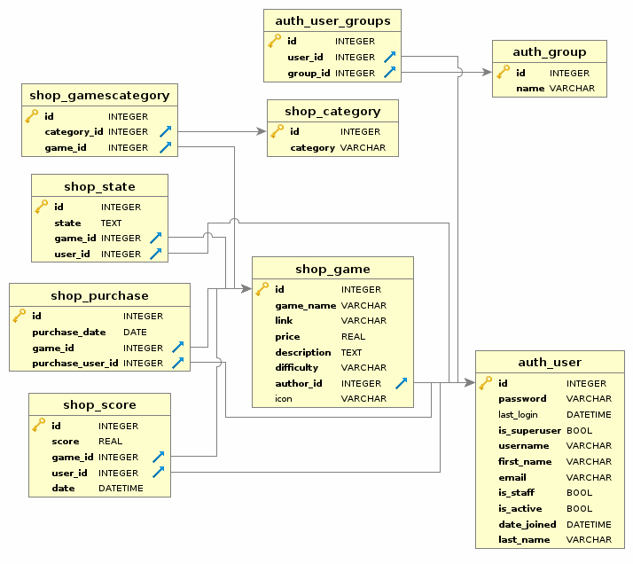

2017-2018 (CS-C3170) Web Software Development Project
-----------------------
### Instruction
[Heroku link here](https://wsd2017.herokuapp.com/)    
To test the site as a developer, you can use the test account below:
> username: `panda`    
> password: `spamspam`

You can also signup as a new user/developer.

### Goal

In this project, we implement an **online game store for JavaScript games**.

The service has two types of users, i.e. players and developers. 
Developers can link their implemented games to the service and set a price for them.
Players can purchase games on the platform and then play them online.

#### DB Schema

#### Pages

 - Homepage
   - List of games
   - Filters
   - Search
   - Sign-up
   - Log-in
   - Third-party login
 - Game Page
   - Overview
   - Purchase buttons 
   - Record of high scores
   - Records & ranks (for users)
   - Game management (for developers)
   - Play game
 - Profile
   - Player: basic information and purchased games
   - Developer: game inventory, function of adding new games
 - Register pages
   - Forms for developers and users
 - Game Sharing Page
   - Share highscore to friends

### Implementation
#### Authentication (200/200p):
 - Login, logout and register (both as player or developer) including Email validation 
 - Use Django auth 
 
> In the first step, users need to register through their emails and fill in the registration form. Then, they choose their user groups (developer/player), which allow different features as shown below:
> - Player group: purchase games, play games, check high scores of a specific game and users' recorded scores.
> - Developer group:  all the functionalities that the player group has, add new games to the inventory, browse a list of game sales.
> After registration, the system will generate a one-time token and send an email to the user to confirm the filled email address.

#### Basic player functionalities (300/300p):
- Search, purchase and play games
- Security restrictions 

> Users can filter games by category, or directly search the game using a name-based query (with auto-complete).
> If the game is purchased successfully, the users can play the game.

#### Basic Developer Functionalities: (150/200p)
- Add a game (URL) and set price for that game and manage that game (remove, modify)
- Basic game inventory and sales statistics (how many of the developers' games have been bought and by how many players)
- Security restrictions, e.g. developers are only allowed to modify/add/etc. their own games, a developer can only add games to their own inventory, etc.
- Add a game (URL), set price for that game and operate it (e.g., remove, modify etc.):

> We build an interface for adding and modifying games.
> Developer can delete a game on the game info page after confirming by typing the game name.
> Basic game inventory and sales statics (the number and the purchased time of sold games) is displayed on the profile page.

#### Game/Service Interaction: (200/200p)
When a player has finished playing a game (or presses submit score), the game sends a postMessage to the parent window containing the current score. This score must be recorded in the player's scores and to the global high score list for that game. See section on Game Developer Information for details.

> We implement a view that manages the interaction between a game and the service.
> Every message is processed according to its type and a response is sent back to the game.

#### Quality of Work: (95p)
- Quality of code (structure of the application, comments)
- Purposeful use of framework 
- User experience (styling, interaction)
- Meaningful testing

> We maintained the structure as simple as possible, trying to reuse the code as much as possible.
> The classes and functions are described in their docstring.
> Tests have been designed to cover the most important features of the service. We also tested through interaction with the browser.

#### Service/Game Messages Save/load and resolution feature: (100/100p)
- The service supports saving and loading for games with the simple message protocol described in Game Developer Information

>We have following messages:

> - SCORE
> Sent from the game to the service, informing the service of a new score submission:
>
> - SAVE
> Sent from the game to the service, and the service stores the sent game state:
> The gameState is saved as a string on the server, allowing the highest flexibility for the game.
>
> - LOAD_REQUEST
> Sent from the game to the service, requesting that a game state (if there is one saved) is sent from the service to the game:
> The service responds either with LOAD or ERROR.
> 
> - LOAD
> Sent from the service to the game:
> The message contains the gameState attribute, which displays the specific state of the game to be loaded.
> 
> - ERROR
> Sent from the service to the game:
> The message contains info attribute, which lets the users realize the mistakes by textual information.
> 
> - SETTING
> Sent from the game to the service once the game finishes loading:
> The message contains option attribute, which records specific configuration of the game to the service. This is mainly used to adjust the layout in the service by providing the desired resolution in pixels.

#### 3rd Party Login: (100/100p)
- Allow OpenID, Gmail or Facebook login to your system. 

> The service supports Google Plus and GitHub login.
 
#### RESTful API: (100/100p)
- Design and implement some RESTful APIs to the service 
- Show available games, high scores 
- Display sales statistics for game developers 
- Authentication with Django OAuth Toolkit

> Implemented RESTful APIs:
>
> - `GET /game/<game_id>`: returns information about the game, including game data, user high-scores and rankings
> - `GET /gamemessage`: the communication endpoint of the service, used to handle the game-service communication
> - `GET /gameslist`: returns a list of games dictionaries. The output can be altered with query parameters such as `category`, `search` (by name) and `page`
> - `GET /profile`: displays info about the user and his/her purchased games
> - `PUT /newgame/`: creates a new game, if the user is authenticated as developer
> - `POST /editgame/`: allows a developer to edit a game
> - `DELETE /deletegame/<game_id>/`: allows a developer to delete a game

#### Own Game: (100/100p)
- Develop a simple game in JavaScript that communicates with the service (at least high score, save, load)
- can only get points for one game that you develop.
- can host the game as a static file in your Django project or elsewhere. But you should include it in your repository.

> We develop a simple [Sudoku](https://marco-z.github.io/sudoku/) game in JavaScript that communicates with the service.
 
#### Mobile Friendly: (50/50p)
- It works on devices (smartphones/tablets) with varying screen width and is usable with touch-based devices. 

> We use the grid system from [materialize.css](http://materializecss.com/) with our customize css to achieve a responsive layout.
 
#### Social Media Sharing: (50/50p)
Enable sharing games & game scores on some social media sites.

> The website supports the sharing of the high score through Twitter, Facebook, and Telegram.
> Sharing page with confetti and fancy spinning panda medal 🐼.

#### Bonus features: (50/50p)
>- Integration with AWS S3 for the management of user-uploaded game images
>- Web App Manifest to install web applications to the home screen of a device.

#### Comments: 
We feel that we were successful in implementing all the features required, as well as some bonus features. The service is working fluently with a good-looking interface. 
We had some issues integrating the third-party REST framework at first, therefore we had to build some work-arounds to customize it to our needs.

### Testing
We focus on the following 4 types of tests:

- Unit Testing
- Functionality Testing
- Integration Testing
- Usability Testing

Here are some more details：

- For the model test, we test whether each element is correctly defined and also the connection using foreign key
- For the API tests, we require that the server is running and we interact with it through python `requests`.
- For the payment part, If the users try to change the amount value or pid in the browser, then the system will warn the error since the private key is not shown to the users.
The database will be only updated after a successful purchase, which effectively avoids the interruption during the process.

